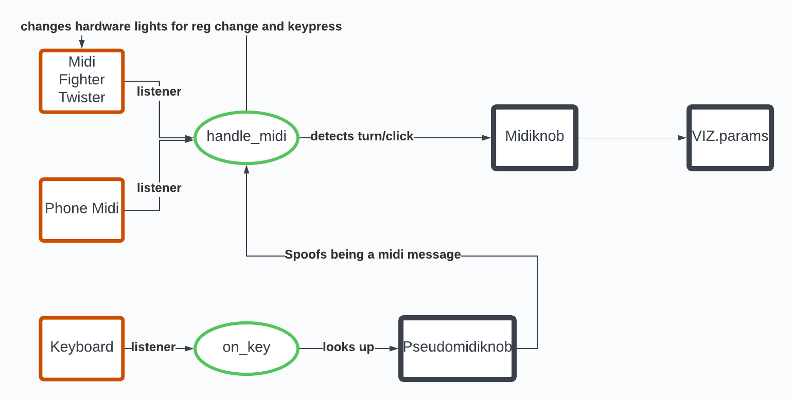

# The Vizard
... simulates an analog visual synthesizer. Looks like this:

## Requirements
"""
pip install PyOpenGL PyOpenGL_accelerate prettytable numpy scipy mido[ports-rtmidi]
"""

## ToDos
- fix the senddataclass to midi
- find a better solution for keeping all midi devices in sync

## Known Issues without a fix
- The Midi FIghter Twister sometimes doesnt send the value when the knob is fully turned in one direction.

## Input Control Diagram
